<!-- animowany kalendarz kontrybucji: prawdziwe dane, kafelki pojawiają się po skosie
     (odświeżane codziennie przez .github/workflows/update-profile-art.yml) -->

<h3><code>jakub@github ~ $ ./kontrybucje.sh</code></h3>

 
 

<!-- logo ASCII (lewo) + karta statystyk (prawo). oba SVG mają 840x880,
     więc przy równych szerokościach mają równe wysokości.
     logo:        python scripts/prep_photo.py jhit.gif --frame 14 --no-rembg && python scripts/make_ascii_svg.py
     statystyki:  python scripts/render_stats_svg.py (ten sam codzienny workflow) -->

<h3><code>jakub@github ~ $ whoami</code></h3>

<table>
<tr>
<td valign="top"></td>
<td valign="top"></td>
</tr>
</table>

 
 

<h3><code>jakub@github ~ $ ./links.sh</code></h3>

<b>Strony WWW · Sieci &amp; VPN · Wsparcie IT · Prywatne AI</b> 
Jednoosobowa firma IT z Krakowa — bez pośredników, Fixed-Price lub SLA, zero vendor lock-in.

 

<code>jakub@github ~ $ cat o-firmie.md</code>

 

Prowadzę jednoosobową firmę informatyczną w Krakowie. Bez agencji, bez pośredników, bez account managerów — **rozmawiasz i pracujesz bezpośrednio ze mną**, od pierwszej rozmowy technicznej po wdrożenie produkcyjne.

| Usługa | Technologie | Dla kogo |
|---|---|---|
| 🌐 **Strony WWW i aplikacje** | React, Next.js, TypeScript, Tailwind | Firmy potrzebujące szybkiej, skonwertowanej strony |
| 🛜 **Sieci i bezpieczny VPN** | MikroTik, UniFi, WireGuard, IPsec, VLAN | Biura bez martwych stref Wi-Fi i bezpiecznej pracy zdalnej |
| 🛠️ **Wsparcie IT i helpdesk B2B** | Windows/Linux/macOS, MDM, backup 3-2-1 | Firmy bez własnego działu IT |
| 🤖 **Prywatne AI i systemy RAG** | Self-hosted LLM, Qdrant, LangChain | Firmy, dla których poufność danych ma znaczenie |

- 💳 Rozliczenia B2B: **Fixed-Price** albo abonament **SLA** — zawsze umowa i NDA przed startem
- 🔓 **Zero vendor lock-in** — pełna dokumentacja, kody źródłowe i hasła trafiają do klienta
- 📍 Kraków, PL — zdalnie cała Polska i UE, on-site Małopolska
- 📈 Google PageSpeed: wydajność **83 → 98**, dostępność **84 → 96**, sprawdzone metody **100**, SEO **100** — case studies na [jhyziak.eu/realizacje](https://www.jhyziak.eu/realizacje)
- ★ **5.0** — [10 opinii na Google](https://www.google.com/search?kgmid=/g/11nvmn5lp0) · [2 opinie na Oferteo](https://www.oferteo.pl/jakub-hyziak-it/firma/7677136)

