<div align="center">

<h3><code>jakub@jhyziak-it ~ $ ./kontrybucje.sh</code></h3>


<br><br>

<h3><code>jakub@jhyziak-it ~ $ whoami</code></h3>
<table>
  <tr>
    <td valign="top"></td>
    <td valign="top"></td>
  </tr>
</table>

<br>

<h3><code>jakub@jhyziak-it ~ $ cat kontakt.txt</code></h3>

[](https://www.jhyziak.eu/)
[](https://www.jhyziak.eu/realizacje)
[](mailto:kontakt@jhyziak.eu)
[](tel:+48797589367)
[](https://www.linkedin.com/in/jakub-hyziak/)
[](https://www.instagram.com/jakubhyziakit)
[](https://www.facebook.com/people/Jakubhyziakit/61593642457807/)

<sub>Umów bezpłatną, niezobowiązującą 30-minutową konsultację techniczną przez <a href="https://www.jhyziak.eu/#kontakt">stronę</a>.</sub>

</div>

<br>

<details>
<summary><code>jakub@jhyziak-it ~ $ cat o-firmie.md</code></summary>

<br>

Prowadzę jednoosobową firmę informatyczną w Krakowie. Bez agencji, bez pośredników, bez account managerów — **rozmawiasz i pracujesz bezpośrednio ze mną**, od pierwszej rozmowy technicznej po wdrożenie produkcyjne.

| Usługa | Technologie | Dla kogo |
|---|---|---|
| 🌐 **Strony WWW i aplikacje** | React, Next.js, TypeScript, Tailwind | Firmy potrzebujące szybkiej, skonwertowanej strony |
| 🛜 **Sieci i bezpieczny VPN** | MikroTik, UniFi, WireGuard, IPsec, VLAN | Biura bez martwych stref Wi-Fi i bezpiecznej pracy zdalnej |
| 🛠️ **Wsparcie IT i helpdesk B2B** | Windows/Linux/macOS, MDM, backup 3-2-1 | Firmy bez własnego działu IT |
| 🤖 **Prywatne AI i systemy RAG** | Self-hosted LLM, Qdrant, LangChain | Firmy, dla których poufność danych ma znaczenie |

- 💳 Rozliczenia B2B: **Fixed-Price** albo abonament **SLA** — zawsze umowa i NDA przed startem
- 🔓 **Zero vendor lock-in** — pełna dokumentacja, kody źródłowe i hasła trafiają do klienta
- 📍 Kraków, PL — zdalnie cała Polska i UE, on-site Małopolska
- 📈 Google PageSpeed: wydajność **83 → 98**, dostępność **84 → 96**, sprawdzone metody **100**, SEO **100** — case studies na [jhyziak.eu/realizacje](https://www.jhyziak.eu/realizacje)
- ★ **5.0** — [10 opinii na Google](https://www.google.com/search?kgmid=/g/11nvmn5lp0) · [2 opinie na Oferteo](https://www.oferteo.pl/jakub-hyziak-it/firma/7677136)

</details>

<details>
<summary><code>jakub@jhyziak-it ~ $ cat jak-to-dziala.md</code></summary>

<br>

Wszystko powyżej to animowane SVG generowane skryptami z [`scripts/`](./scripts) — bez zewnętrznych serwisów ze statystykami, bez tokenu, bez JavaScriptu.

| Plik | Skrypt | Odświeżanie |
|---|---|---|
| `contrib-heatmap.svg` | `fetch_contributions.py` → `render_heatmap_svg.py` | codziennie, [GitHub Actions](./.github/workflows/update-profile-art.yml) |
| `jhit-ascii.svg` | `prep_photo.py` → `make_ascii_svg.py` | ręcznie, przy zmianie logo/zdjęcia |
| `info-card.svg` | `make_info_card.py` | ręcznie, przy zmianie treści |

```bash
python -m venv .venv && source .venv/bin/activate
pip install -r scripts/requirements-portrait.txt
python scripts/prep_photo.py jhit.gif --frame 14 --no-rembg   # albo: zdjecie.jpg
python scripts/make_ascii_svg.py
python scripts/make_info_card.py
```

</details>
